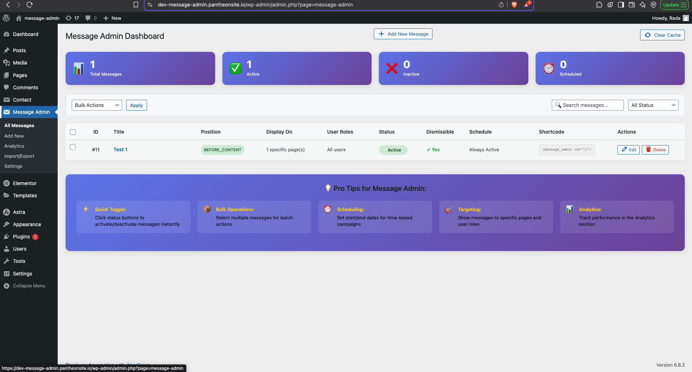
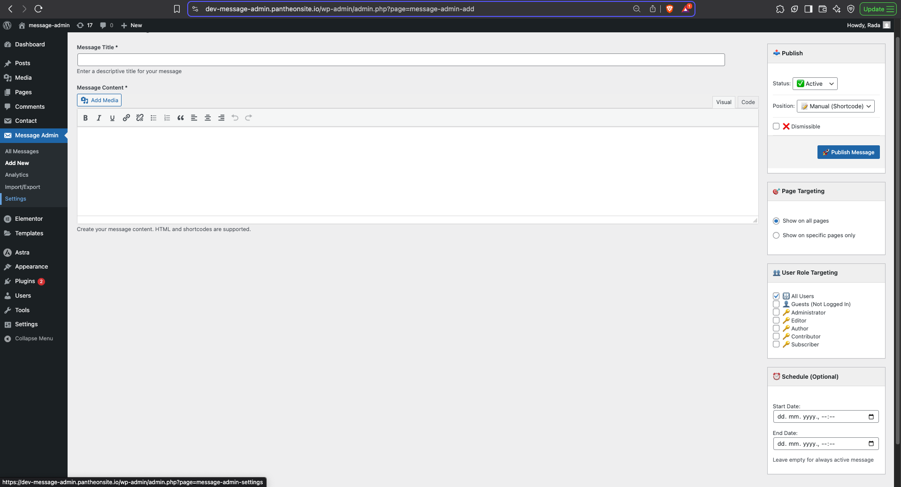
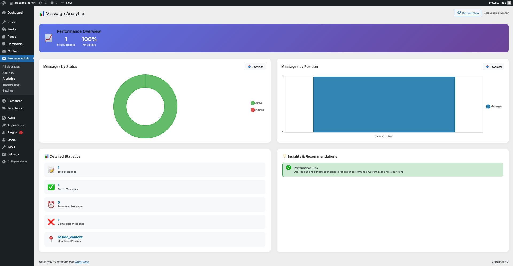

# Message Admin

🚀 **WordPress Plugin** for displaying custom messages with smart targeting and responsive design.


**Live Demo:** <a href="https://dev-message-admin.pantheonsite.io/home/" target="_blank">Try it Live</a>

## ✨ Key Features

- 🎯 **Smart Targeting** - Display messages to specific pages and user roles
- 📱 **Responsive Design** - Mobile-first admin interface
- ⚡ **Performance Optimized** - Built-in caching system
- 📊 **Analytics Dashboard** - Interactive charts with Chart.js
- 🛠️ **Easy Management** - Bulk operations and export/import

## 🚀 Quick Setup

### Required Plugins & Theme
To properly display the demo site, install:

1. **Message Admin Pro** (this plugin)
2. **Astra Theme** - Free WordPress theme
3. **Elementor** - Page builder plugin
4. **Contact Form 7** - Contact form plugin

### Installation Steps
1. Download `message-admin.zip`
2. Upload to WordPress: **Plugins → Add New → Upload Plugin**
3. Activate the plugin
4. Install other required plugins above
5. Go to **Message Admin** in admin menu

## 📖 Usage

### Create Message
1. **Message Admin → Add New**
2. Enter title and content
3. Choose position (Before Content, After Content, Header, Footer)
4. Set targeting (pages, user roles)
5. Publish

### Shortcode
```php
[message_admin id="1"]
```

### Theme Integration
```php
message_admin_display(1); // Display specific message
```

## 🖼️ Screenshots

| Admin Dashboard | Message Editor |
|---|---|
|  |  |

| Analytics | Frontend Display |
|---|---|
|  |  |

## 🛠️ Technical Stack

- **Backend:** PHP 7.4+, MySQL
- **Frontend:** JavaScript, CSS Grid/Flexbox
- **Charts:** Chart.js
- **Caching:** WordPress Transients
- **Security:** Nonce verification, data sanitization

## 🎯 Use Cases

- Site-wide announcements
- User role-specific messages
- Scheduled maintenance notices
- Marketing call-to-actions
- Admin notifications

## 📱 Mobile-First Design

- Responsive admin tables → mobile cards
- Touch-friendly controls
- Optimized for all screen sizes

## 🔧 File Structure

```
message-admin/
├── message-admin.php          # Main plugin
├── includes/
│   ├── admin-panel.php        # Admin interface
│   ├── frontend-display.php   # Display logic
│   └── message-widget.php     # Widget support
└── assets/
    ├── admin-style.css        # Admin CSS
    ├── admin-script.js        # Admin JS
    ├── frontend-style.css     # Frontend CSS
    └── frontend-script.js     # Frontend JS
```

## 🚀 Demo Site Requirements

For the full demo experience:
- WordPress 5.0+
- Astra Theme (free)
- Elementor (free version)
- Contact Form 7
- Message Admin Pro plugin

## 👤 Author

**Rada Ivanković**
- 🌐 [Portfolio](https://portfolio-v2-topaz-pi.vercel.app/)
- 💻 [GitHub](https://github.com/rada-ii)


⭐ **Professional WordPress plugin development showcase**
